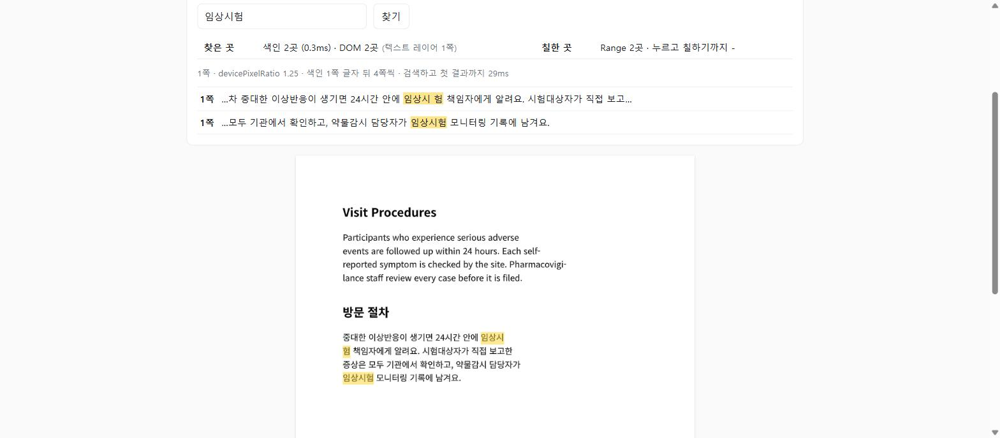

# pdf-full-text-search

react-pdf로 화면 근처 쪽만 그릴 때, 텍스트 레이어에 기대지 않고 문서 전체에서 글자를 찾고 칠하는 최소 예제예요.
블로그 글 [「'임상시험'이 두 번 있는데 한 번만 찾는다」](https://danbom425.tistory.com/entry/pdf-full-text-search)(브라우저에서 문서 다루기 #5)의 재현 저장소입니다.
[4편 저장소](https://github.com/danbom/pdf-page-virtualization)의 「보이는 쪽만」 뷰어에 검색을 붙였어요.

**▶ 라이브 데모: https://pdf-full-text-search.vercel.app**

[](https://pdf-full-text-search.vercel.app)

## 결론 먼저

**줄 바꿈 1쪽**(`public/wrap.pdf`)에서 찾고 칠한 곳이에요. 줄 끝에서 잘린 단어, 합자(ff·fi), 띄어쓰기가 다른 검색어를 넣어 뒀어요.

| 검색어 | 찾아야 할 곳 | pdf.js 기본 뷰어 찾기 | 조각마다 `<mark>` (react-pdf 10.5) | 조각마다 `<mark>` (react-pdf 11.0) | 접어서 찾고 Range로 칠하기 |
| --- | --- | --- | --- | --- | --- |
| serious adverse events | 1 | 1 | 0 | 0 | 1 |
| self-reported | 1 | **0** | 0 | 0 | 1 |
| pharmacovigilance | 1 | 1 | 0 | 0 | 1 |
| staff | 1 | 1 | 0 | 0 | 1 |
| 임상시험 | 2 | **1** | 0 | 1 | 2 |
| 임상 시험 | 2 | **0** | 0 | 0 | 2 |
| 책임자에게 알려요 | 1 | 1 | 0 | 1 | 1 |

- pdf.js 기본 뷰어는 pdfjs-dist 5.7.284의 `PDFFindController`로 찾은 개수예요. 줄 끝 「임상시\n험」의 줄 바꿈을 공백으로 바꿔서 놓치고, 「self-\nreported」는 하이픈까지 지워 「selfreported」로 만들어요
- 조각마다 `<mark>`는 `customTextRenderer`로 텍스트 조각(item) 하나씩 검색어를 감싸는 방식이에요. 검색어가 조각 두 개에 걸치면 못 칠해요.
  react-pdf 10.5.0(pdfjs-dist 5.4.296)은 이 PDF를 172조각(대략 낱말·음절 하나씩)으로, 11.0.0(pdfjs-dist 6.3.289)은 19조각(대략 한 줄씩)으로 돌려줘요
- 접어서 찾기는 `lib/search.ts`, Range로 칠하기는 `lib/highlight.ts`예요

**300쪽**(`public/long.pdf`)에서 색인을 언제 만들지에 따라 1쪽이 뜨는 시간이 달라져요. 3번씩 잰 범위예요.

| 색인 시점 | 1쪽 그림 | 1쪽 글자 | 색인 끝 (페이지를 연 뒤) |
| --- | --- | --- | --- |
| 색인 없음 | 0.59~0.75초 | 0.67~0.87초 | - |
| 열자마자 300쪽 전부 | **1.47~1.56초** | **1.52~1.58초** | 1.41~1.48초 |
| 1쪽 글자 뒤 1쪽씩 | 0.64~0.86초 | 0.74~1.04초 | 1.78~2.31초 |
| 1쪽 글자 뒤 4쪽씩 (동시에 4개) | 0.53~0.87초 | 0.61~1.02초 | 1.24~2.04초 |
| 처음 검색할 때 1쪽씩 | 0.66~0.70초 | 0.67~0.81초 | 검색하고 0.75~0.88초 뒤 250쪽 결과 |

- 색인은 원문 115만 자와 접은 글자 100만 자예요. 「Section 250」을 찾는 데 0.8~2.2ms 걸렸어요(색인이 도는 중에 잰 한 번, 6ms는 뺐어요)
- 처음 열었을 때 텍스트 레이어가 있는 쪽은 두 쪽뿐이라, DOM에서 찾으면 0곳이에요
- 결과를 눌러 250쪽으로 가서 그리고 칠하기까지 0.16~0.40초였어요

## 실행

```bash
npm install
npm run build && npm start   # http://localhost:3000 — 숫자는 이렇게 띄워서 쟀어요
npm run versions             # next / react-pdf / pdfjs-dist 버전 확인
```

`next.config.ts`는 비어 있어요. 이유는 [1편 저장소](https://github.com/danbom/nextjs-pdfjs-minimal)에 있습니다.

## 화면에서 볼 것

1. **300쪽**에서 「Section 250」을 찾아 보세요. 색인은 1곳, DOM은 0곳으로 나와요. 결과를 누르면 250쪽으로 가서 칠해요
2. 색인 시점을 **열자마자 전부**로 바꾸면 「1쪽 그림」과 「1쪽 글자」가 두 배쯤 늦어져요. pdf.js 워커가 300쪽의 글자를 먼저 뽑느라 1쪽 그리기가 뒤로 밀리는 것으로 보여요
3. **줄 바꿈 1쪽**에서 「임상시험」, 「임상 시험」, 「self-reported」를 찾아 보세요. 두 줄에 걸친 곳도 칠해요
4. 칠하기를 **조각마다 `<mark>`**로 바꾸면 위 검색어는 하나도 칠하지 못해요. 「reported」처럼 조각 하나 안에 있는 낱말만 칠해요.
   검색어를 바꿀 때마다 텍스트 레이어를 처음부터 다시 그리는 것도 볼 수 있어요(Range 방식은 DOM을 건드리지 않아요)

## 코드

- `lib/search.ts` — 색인과 검색
  - `pageText` — `getTextContent()`의 조각을 이어 붙여요. `hasEOL`인 조각 뒤에는 `\n`을 넣어요
  - `fold` — NFKC, 소문자, 공백·하이픈 버리기. `withMap`이면 접은 글자가 원래 몇 번째 글자였는지도 돌려줘요
  - `indexPages` — 쪽 번호를 `concurrency`개씩 동시에 색인해요
  - `search` — 쪽마다 `indexOf`로 겹치지 않게 찾아요
- `lib/highlight.ts` — 그려진 텍스트 레이어의 텍스트 노드를 모아 같은 규칙으로 접고, 찾은 자리를 `Range`로 되돌려 `CSS.highlights`에 넣어요
- `app/lab.tsx` — 화면 전부. `LazyPage`는 4편과 같아요
- `scripts/wrap.html`, `scripts/make-wrap-pdf.mjs` — 줄 바꿈 1쪽 PDF 원본과 생성기
- `scripts/make-long-pdf.py` — 300쪽 PDF 생성기(4편과 같음)

접어서 찾기는 공짜가 아니에요. 공백을 버리니 「every day」로 「everyday」도 찾고, 하이픈을 버리니 「re-sign」과 「resign」을 구별하지 못해요.
낱말 단위로 찾아야 하는 화면이라면 따로 처리해야 해요.

## 확인한 버전과 잰 방법

- Next.js 16.3.6 · React 19.3.0 · react-pdf 10.5.0 · pdfjs-dist 5.4.296으로 `next build` → `next start` 한 뒤,
  Playwright로 headless Chromium 140을 띄워서 쟀어요(viewport 1280×900, deviceScaleFactor 2).
  이 저장소를 새로 받아 `npm install` 하면 Next.js 16.3.7이 깔리는데, 여기서도 같은 결과가 나오는 걸 확인했어요
- react-pdf 11.0.0(pdfjs-dist 6.3.289)은 `package.json`만 바꿔 같은 코드로 빌드해서 확인했어요.
  pdfjs-dist 6.3.289는 `Map.prototype.getOrInsertComputed`를 써서, Chromium 140에서는 `getOrInsertComputed is not a function` 오류가 나고 「This page couldn't load」 화면이 떠요.
  그래서 이 확인만 테스트 스크립트에서 이 메서드를 채워 넣고 돌렸어요(MDN 기준 Chrome 145, Firefox 144, Safari 26.2부터 있어요)
- 조각 수는 같은 `wrap.pdf`를 pdfjs-dist 여러 버전의 `getTextContent()`로 세었어요. 5.5.207까지는 172조각, 5.6.205부터 19조각이에요
- pdf.js 기본 뷰어의 찾기는 pdfjs-dist 5.7.284의 `web/pdf_viewer.mjs`(`PDFViewer`, `PDFFindController`)를 headless Chromium 141에 띄워서 셌어요. `wrap.pdf`도 Chromium 141로 인쇄했어요
- 「1쪽 그림」은 1쪽 `onRenderSuccess`, 「1쪽 글자」는 1쪽 `onRenderTextLayerSuccess`까지의 `performance.now()`예요. 시간은 모두 3번씩 잰 범위예요

## 테스트 PDF 다시 만들기

```bash
python3 scripts/make-long-pdf.py public 300   # public/long.pdf (reportlab 필요)
npm i -D playwright && npx playwright install chromium
npm run make:wrap                             # public/wrap.pdf (Noto Sans CJK KR 글꼴 필요)
```

`wrap.pdf`는 줄 바꿈 위치를 고정하려고 줄마다 `div`로 나눠 Chromium으로 인쇄했어요.
Chromium은 `word-break` 기본값에서 한국어 낱말 중간에서도 줄을 바꿔서(따로 확인했어요), 브라우저에서 인쇄한 PDF라면 「임상시 / 험」 같은 줄이 생길 수 있어요.
글꼴이 다르면 줄 폭이 바뀌어서 잘리는 자리도 달라질 수 있어요.

## 만든 방법

이 저장소는 에이전트(Claude)와 같이 만들었어요. 어떤 문제를 다룰지와 어디까지 공개할지는 제가 정했고, 코드는 에이전트가 쓰고 제가 읽고 검토했어요. 글에 쓴 숫자는 모두 이 코드로 실제로 돌려 본 값이고, 틀린 곳이 있다면 책임은 저에게 있어요.
